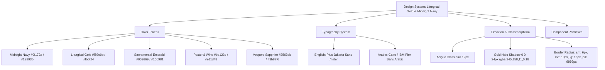
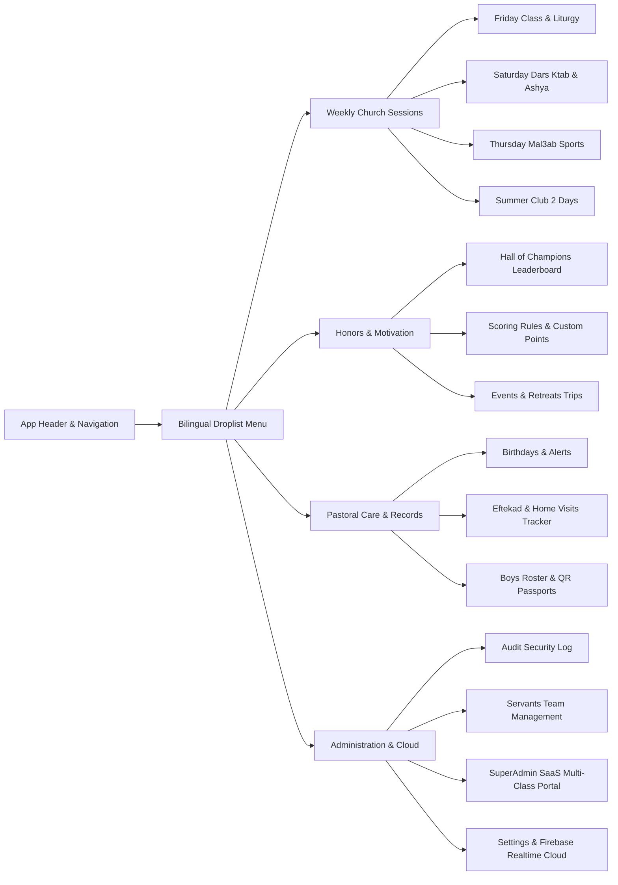

# ✝️ Google Stitch Master Design Specification
## Pope Saweros Sunday School Cloud Scoring & Pastoral Management System
### (نظام إدارة نقاط وخدمة فصل البابا ساويرس - أسرة الآباء السواح)

> **Document Purpose**: This comprehensive specification is tailored specifically for **Google Stitch** (and modern AI UI/UX design engines such as Figma AI, Galileo, v0) to generate the complete, high-fidelity, production-grade app design, design system, component library, and multi-screen user journeys for both mobile and desktop/large-screen experiences.

---

## 1. Executive Product Overview & Design Vision

### 1.1 Core Mission
The **Pope Saweros Sunday School Platform** is a specialized, real-time pastoral care, gamified attendance, and scoring application created for the Coptic Orthodox Church (Grade 4 Boys Class – "Pope Saweros", under the "Abaa Family" / أسرة الآباء السواح).

The application bridges two distinct operational environments:
1. **Servant Field Mobile App (Handheld / PWA)**: Fast, tactical, one-handed operation during church services (scanning student QR passports, logging liturgical attendance, recording pastoral home visits, awarding instant behavior points).
2. **Classroom TV / Projector Display (Large Screen 4K/1080p)**: Celebratory, high-contrast, gamified display showcasing the **Hall of Champions (لوحة الشرف والأبطال)** with 3D podiums, spotlight hero badges, and real-time attendance tickers that wow the boys and inspire spiritual engagement.

### 1.2 Target Personas
- **Church Servants (خدام الفصل)**: Need rapid, tactile scanning, zero-friction toggle lists, bilingual Arabic/English labels, offline reliability, and instant cloud sync across multiple phones simultaneously.
- **Class Admins & Priests (أمين الخدمة والآباء الكهنة)**: Need comprehensive 360° student spiritual dossiers, monthly confession trackers, home visit (افتقاد) history, and automated birthday alerts.
- **Sunday School Boys (أولاد الفصل - الصف الرابع الابتدائي)**: Motivated by dignified gamification—earning points for Liturgy (قداس), Bible Study (درس كتاب), Sports Pitch (ملعب), hymns, and honorable spiritual badges (أبطال الفصل).
- **Platform SuperAdmin**: Master multi-tenant overview managing multiple Sunday School classes, servant approvals, and daily automated rolling backups.

### 1.3 Design Tone & Aesthetic Principles
- **Liturgical Dignity Meets Modern Neo-Fintech**: Avoid cheap, cartoonish gamification. The visual language reflects church reverence—deep midnight slates, warm liturgical candlelight amber/gold, emerald sacramental greens, and sacred burgundy accents.
- **Bilingual Typographic Harmony**: Seamless dual-language layout (English and Arabic) with bidirectional typography (LTR & RTL consideration) ensuring Arabic church terminology (قداس, عشية, درس كتاب, افتقاد, شماس, أب الاعتراف) reads naturally alongside modern English data tables.
- **Tactile Depth & Glassmorphism**: Soft elevation shadows, subtle gold border micro-accents, translucent acrylic backdrops, and laser scanline animations.

---

## 2. Complete Design System & Style Tokens (Design Tokens)



### 2.1 Color Palette

| Token Name | Hex Code | HSL | Semantic Meaning & Usage |
| :--- | :--- | :--- | :--- |
| `--bg-main` | `#f8fafc` | `210° 40% 98%` | Primary light background (crisp ivory paper) |
| `--bg-surface` | `#ffffff` | `0° 0% 100%` | Card surfaces, modals, popovers |
| `--bg-dark-base` | `#0f172a` | `222° 47% 11%` | Night/Projector mode background (Church Midnight) |
| `--bg-dark-card` | `#1e293b` | `217° 33% 17%` | Elevated cards in projector/TV mode |
| `--accent-gold` | `#f59e0b` | `38° 92% 50%` | Liturgical Gold, primary CTAs, crown badges, honors |
| `--accent-gold-light` | `#fbbf24` | `45° 93% 47%` | Gold highlights, 1st place champion text, glowing borders |
| `--accent-gold-subtle` | `rgba(245, 158, 11, 0.12)` | - | Pill backgrounds, active navigation highlights |
| `--color-liturgy` | `#059669` | `161° 94% 30%` | Friday Class & Liturgy (قداس), verified checkmarks |
| `--color-liturgy-bg` | `#ecfdf5` | `152° 76% 96%` | Liturgy active chip backgrounds |
| `--color-vespers` | `#2563eb` | `221° 83% 53%` | Saturday Dars Ktab (درس كتاب) & Ashya (عشية) |
| `--color-vespers-bg` | `#eff6ff` | `214° 100% 97%` | Bible study badge fills |
| `--color-pitch` | `#16a34a` | `142° 71% 45%` | Thursday Mal3ab (الملعب والنشاط الرياضي) |
| `--color-summer` | `#ea580c` | `25° 95% 53%` | Summer Club (النادي الصيفي - يومين) |
| `--color-pastoral` | `#be123c` | `345° 83% 41%` | Home Visits (افتقاد), Confession, Urgent Alerts |
| `--color-superadmin` | `#7c3aed` | `262° 83% 58%` | SaaS Master Control, Multi-Tenant badges |
| `--text-primary` | `#0f172a` | `222° 47% 11%` | High-contrast body and heading text |
| `--text-muted` | `#64748b` | `215° 16% 47%` | Secondary descriptions, timestamps, metadata |
| `--border-subtle` | `#e2e8f0` | `214° 32% 91%` | Card separators, inactive borders |

### 2.2 Typography Scale
- **Font Stack English**: `Plus Jakarta Sans`, `Inter`, `-apple-system`, `sans-serif`
- **Font Stack Arabic**: `Cairo`, `Tajawal`, `IBM Plex Sans Arabic`, `sans-serif`
- **Code / Student ID**: `SF Mono`, `Fira Code`, `monospace`

| Style | Size (rem / px) | Weight | Line Height | Usage |
| :--- | :--- | :--- | :--- | :--- |
| **Display XXL** | `2.5rem / 40px` | Bold 800 | 1.15 | Projector Champions 1st Place, Leaderboard Header |
| **Heading XL** | `1.75rem / 28px` | Bold 700 | 1.25 | View Titles, Top Modal Headers |
| **Heading LG** | `1.25rem / 20px` | SemiBold 600 | 1.35 | Section Headers, Student Card Names |
| **Body Default** | `0.938rem / 15px` | Regular 400 | 1.5 | Standard text, list items, dialog descriptions |
| **Label Medium** | `0.813rem / 13px` | SemiBold 600 | 1.2 | Badges, Table Headers, Button text |
| **Caption Small** | `0.75rem / 12px` | Medium 500 | 1.2 | Timestamps, Student ID pill, secondary status |

### 2.3 Surface & Shadow Tokens
- **Card Shadow (Soft)**: `0 4px 6px -1px rgba(0, 0, 0, 0.06), 0 2px 4px -2px rgba(0, 0, 0, 0.04)`
- **Elevated Popover / Modal**: `0 20px 25px -5px rgba(15, 23, 42, 0.15), 0 8px 10px -6px rgba(15, 23, 42, 0.1)`
- **Gold Glow (Champions Podium)**: `0 0 35px -5px rgba(245, 158, 11, 0.35)`
- **Glassmorphic Surface**: `background: rgba(255, 255, 255, 0.85); backdrop-filter: blur(12px); border: 1px solid rgba(226, 232, 240, 0.8);`

---

## 3. Global Information Architecture & Navigation



### 3.1 App Header Bar (Universal Component)
- **Left**:
  - Church Cross icon ✝️ with warm gold fill.
  - Class Title: **"Pope Saweros Class"** (Arabic subtitle: *فصل البابا ساويرس - أسرة الآباء السواح*).
  - Class Room Badge (`#popesaweros4`) with copyable room code.
- **Center**:
  - **Categorized Navigation Droplist (`NavDroplist`)**: A modern grouped dropdown menu showing icons, English/Arabic labels, colored category tags, and dynamic badges (e.g. `Fri`, `Sat`, `Thu`, `Live`, `3 Birthdays Soon!`).
- **Right**:
  - **Firebase Cloud Real-Time Indicator**: Glowing green pulse with tooltip *"Connected to Google Cloud Firestore • 4 Servants Live"*.
  - **Quick Scan FAB Button**: Direct camera shortcut to open scanner from any screen.
  - **Active Servant Profile Pill**: Shows logged-in servant avatar, name (e.g. "George Michael"), role badge (`Admin` / `Servant`), and quick settings dropdown.

---

## 4. Screen-by-Screen Detailed Blueprints

### Screen 1: Multi-Tenant Login & Servant Onboarding (`LoginView`)
- **Visual Style**: Deep slate background with gold ambient gradient radial burst behind a high-resolution Coptic Cross & Church Seal.
- **Key Elements**:
  - **Class Selector Tab**: Allows picking between configured classes or typing a custom class slug.
  - **Role Mode Switcher**: Standard Servant Login vs. SuperAdmin Master Portal Login.
  - **Input Fields**:
    - Username (`@servant.name` with `@` prefix adornment).
    - Password (with show/hide eye toggle and biometric fingerprint icon for saved credentials).
  - **Quick Action**: *"Register as New Servant"* link which opens an onboarding drawer requiring admin approval.
  - **Security Indicator**: *"Encrypted Real-Time Sunday School Sync"* with SSL shield.

---

### Screen 2: Friday Fullscreen Scanner & Live Session (`FridayFullscreenScanner`)
- **Visual Style**: Tactical HUD / Dark Navy Viewport (`#0b0f19`) engineered for fast outdoor or indoor scanning under any church lighting conditions.
- **Key Elements**:
  - **Split Screen Layout**:
    - **Top / Left Viewport**: Live camera feed framed in a high-tech gold reticle with animated laser scanline (`#f59e0b`), flash toggle button, front/back camera switcher, and sound volume mute/unmute icon.
    - **Bottom / Right Control Deck**:
      - **Live Class Timer Bar**: Large digital stopwatch showing elapsed minutes since Friday morning service began.
      - **Late Cutoff Warning Badge**: Dynamic status displaying *"On Time (+10 pts)"* vs. *"Late Arrival (-1 pt / 2 mins)"*.
      - **Biometric Stop Lock**: Secure Touch ID / Screen Lock button to officially close the attendance window.
  - **Instant Scan Overlay Modal**:
    - Pops up for 2.5 seconds upon scanning a boy's passport.
    - Synthesizes a pleasant dual-tone sine wave audio chime (Web Audio API).
    - Shows boy's photo, English name, Arabic name, Deacon badge (شماس), attendance status, points awarded (+15 pts), and current total class rank.

---

### Screen 3: Friday Class & Liturgy Dashboard (`AttendanceView`)
- **Visual Style**: Clean, tabular ivory grid with large touch-friendly toggle cards.
- **Key Elements**:
  - **Date Selector**: Quick jumper to previous or upcoming Fridays with calendar picker.
  - **Summary Metrics Bar**:
    - Total Boys (e.g. 42).
    - Class Attendance Rate (`88%`).
    - Liturgy / Communion (قداس) Rate (`76%`).
    - Late Arrivals count.
  - **Student Row Component**:
    - Boy Avatar with initials fallback or photo.
    - Names: Primary English + Secondary Arabic (`أندي وائل إبراهيم`).
    - **Dual Pill Toggles**:
      - `Sunday School Class` (Emerald Green toggle).
      - `Holy Liturgy / Odas` (Warm Amber toggle with Chalice icon).
    - Late Arrival chip with minute counter and point penalty deduction.
    - Quick actions: View Profile, Edit, Award Custom Points.

---

### Screen 4: Hall of Champions & Spotlight Heroes (`ClassHeroesLeaderboardView`)
- **Dual Display Modes**:
  1. **Servant Mobile Card View**: Filterable list sorted by total points.
  2. **Projector / TV 4K Fullscreen Presentation Mode**: Cinematic dark background with floating gold dust particles, high contrast, and dynamic podium animations.
- **Key Elements**:
  - **3D Top 3 Podium**:
    - **1st Place**: Towering central gold pillar with shining golden crown (👑), student large avatar, point badge, and golden fireworks confetti.
    - **2nd Place**: Silver pillar (left) with silver star badge.
    - **3rd Place**: Bronze pillar (right) with bronze trophy badge.
  - **Weekly Spotlight Champions Carousel (أبطال الفصل)**:
    - Dedicated hero cards highlighting boys honored this week for exceptional spiritual commitment.
    - Badges:
      - 👑 *King of Spiritual Discipline* (بطل الالتزام الروحي)
      - 🔥 *Bible Study Flame* (بطل مسابقة الإنجيل)
      - ✝️ *Altar & Hymns Champion* (بطل الشمامسة والألحان)
      - 🛡️ *Shield of Brotherly Love* (بطل المحبة والعطاء)
      - ⭐ *Star of Perseverance* (بطل النشاط والمواظبة)
  - **Leaderboard Data Table**:
    - Rank number, boy name, points tally, breakdown mini-bars (Liturgy, Class, Bible Study, Pitch, Confession), and trend arrow (▲ 2 ranks up).

---

### Screen 5: Scoring Rules & Manual Point Granter (`ScoringView`)
- **Key Elements**:
  - **Interactive Rule Cards**: Visual summary cards detailing points allocated for each church activity:
    - *Friday Class*: `+10 pts`
    - *Holy Liturgy (قداس)*: `+15 pts`
    - *Bible Study (درس كتاب)*: `+10 pts`
    - *Vespers (عشية)*: `+5 pts`
    - *Mal3ab Sports (ملعب)*: `+10 pts`
    - *Mal3ab Sportsmanship*: `+5 pts`
    - *Monthly Confession (اعتراف)*: `+20 pts`
    - *Church Retreats & Trips*: `+20 pts`
  - **Quick Point Award Modal (`CustomPointsModal`)**:
    - Servant can select any student and award positive (+1 to +50) or negative (-1 to -10) points.
    - **One-Tap Reason Chips**: *"Answered Bible Question"*, *"Memorized Coptic Hymn"*, *"Helped Clean Sanctuary"*, *"Disruptive Behavior"*.
    - Logs servant username and date into the immutable audit trail.

---

### Screen 6: Saturday Dars Ktab & Ashya Tracker (`DarsKtabView`)
- **Visual Style**: Sapphire blue accent palette reflecting Saturday evening vespers.
- **Key Elements**:
  - Dual checkboxes per student:
    - `عشية` (Attended Saturday Vespers).
    - `درس كتاب` (Attended Saturday Bible Study).
  - Quick summary: Total attended Bible study, points credited automatically.

---

### Screen 7: Thursday Mal3ab (Sports & Pitch) View (`Mal3abView`)
- **Visual Style**: Athletic turf-green aesthetic (`#16a34a`) maintaining liturgical order.
- **Key Elements**:
  - Dual-action tracking:
    - `حضور الملعب` (Field Presence).
    - `مشاركة ولعب الماتش` (Active match participation & Christian sportsmanship).
  - Team / Match divider generator for dividing boys into balanced teams.

---

### Screen 8: Summer Club Two-Day Program (`SummerClubView`)
- **Visual Style**: Warm summer sunrise palette (`#ea580c`).
- **Key Elements**:
  - **Subpage Tab Switcher**: Day 1 (Default Tuesday) vs. Day 2 (Default Thursday).
  - Tracking options:
    - `حضور النادي` (Club Attendance).
    - `الورشة والنشاط` (Spiritual Workshop, Crafts, Coptic Hymns).

---

### Screen 9: Pastoral Care & Eftekad Home Visits (`VisitsView`)
- **Visual Style**: Warm terracotta and deep rose tones representing family and pastoral intimacy.
- **Key Elements**:
  - **Visit Status Pipelines**: `Scheduled` ➔ `In Progress (Active)` ➔ `Completed` ➔ `Cancelled`.
  - **Live Visit Session Tracker (Stopwatch)**:
    - When a servant arrives at a boy's home, they tap *"Start Home Visit"*.
    - An in-session floating bar shows the timer ticking, with options to:
      - Add live photos (family, prayer corner).
      - Dictate/type spiritual pastoral notes and prayer requests.
      - Stop and save the visit duration.
  - **Direct Contact Action Bar**:
    - Boy's Mobile (`tel:` & `whatsapp://`).
    - Father's Mobile (`tel:` & `whatsapp://`).
    - Mother's Mobile (`tel:` & `whatsapp://`).
    - One-tap WhatsApp greeting templates in Arabic.

---

### Screen 10: Monthly Confession Tracker (`ConfessionRecord`)
- **Visual Style**: Sacred burgundy and violet tones.
- **Key Elements**:
  - 12-Month Grid: Visual checklist for each month (Jan through Dec).
  - Track priest name (`أب الاعتراف`) e.g. "Abouna Saweros", "Abouna Mina".
  - Scheduled day of month indicator (e.g. Day 15 of every month) with reminder warnings if the boy is overdue for confession.

---

### Screen 11: Birthdays & Pastoral Alerts (`BirthdaysView`)
- **Key Elements**:
  - **Urgent Notification Banner**: Prominently highlights boys whose birthdays are **Today** or in the next **3 Days**.
  - **Monthly Calendar Matrix**: Groups boys by month and date.
  - **One-Click Celebration Message**: Formats an Arabic birthday blessing with the boy's name ready to send directly via WhatsApp to parents.

---

### Screen 12: Boys Roster & Printable QR Passport Badges (`StudentListView`)
- **Key Elements**:
  - Search by Name (Arabic or English), ID, or Series Code.
  - **"Download All QR Passports (ZIP)"**: One-click batch exporter generating high-resolution printable cards for all students.
  - **Official Church Passport Card Design (Canvas/Printable)**:
    - Dimensions: 600 x 760 px.
    - Background: Deep Church Midnight gradient (`#0f172a` to `#1e293b`).
    - Gold double border with cross insignia ✝️.
    - Header: *"✝️ SUNDAY SCHOOL PASSPORT - POPE SAWEROS CLASS"*.
    - High-contrast QR code centered on a crisp ivory pill card.
    - Large Monospace ID code: `ID: AWI1012`.
    - Boy details: Series code, DOB, Deacon indicator (شماس).

---

### Screen 13: 360° Comprehensive Student Dossier Modal (`StudentDetailModal`)
- **Multi-Tab Architecture**:
  - **Tab 1: Overview & Pastoral Care**:
    - Boy's Photo, Arabic/English Names, School, Address, Deacon status.
    - **5 Love Languages Badge**: (Words of Affirmation, Quality Time, Receiving Gifts, Acts of Service, Physical Touch).
    - **Pastoral Weak Points & Spiritual Needs**: Confidential notes for servants on how to care for the boy's soul and behavior.
    - **Hobbies & Talents**: Interests, sports, instruments, Coptic hymns memorized.
  - **Tab 2: Attendance Ledger**: Comprehensive history across Friday Class, Liturgy, Saturday Bible Study, Mal3ab, and Summer Club.
  - **Tab 3: Points & Honors Log**: Detailed timeline of all points earned and hero badges received.
  - **Tab 4: Confession & Sacrament Record**: Monthly confession log with Father of Confession.
  - **Tab 5: Home Visits (افتقاد)**: History of home visits, duration, photos, and servant notes.

---

### Screen 14: Settings, Cloud Sync & Biometrics (`SettingsModal`)
- **Key Elements**:
  - **Firebase Cloud Configuration**: Live credentials viewer and editor (`apiKey`, `projectId`, `measurementId`, etc.) with instant connection test.
  - **Biometrics & Security Toggle**: Enable/disable Touch ID / Face ID / Screen Lock for ending Friday timer and accessing confidential pastoral notes.
  - **Scoring Multipliers**: Sliders to adjust default points per event.
  - **JSON Data Backup & Restore**: One-click export of the entire church database to encrypted JSON and instant recovery.

---

### Screen 15: SuperAdmin Multi-Class SaaS Portal (`SuperAdminPortal`)
- **Visual Style**: Imperial violet and dark slate theme representing multi-tenant governance.
- **Key Elements**:
  - **All-Church Classrooms Grid**: Manage multiple grades and classes (`Grade 4 Pope Saweros`, `Grade 5 St. George`, `Grade 6 St. Mina`).
  - **Servant Approval Queue**: Review, approve, or reject pending servant registrations.
  - **Daily Rolling 3-Day Backup Snapshots**: Automated rolling JSON backups with size, timestamp, and one-click disaster recovery restoration.
  - **Platform-Wide Metrics**: Total registered boys, total active servants, total attendance scans this month.

---

### Screen 16: Security Audit Log (`AuditLogView`)
- **Key Elements**:
  - Filter by category: `Auth`, `Attendance`, `Scoring`, `Heroes`, `Visits`, `Students`, `SuperAdmin`.
  - Chronological activity cards with servant avatar, timestamp, IP/device info, action performed, and JSON before/after state diff.

---

## 5. Micro-Interactions, Audio Haptics & Feedback

| Trigger Action | Visual Feedback | Audio / Haptic Feedback |
| :--- | :--- | :--- |
| **Successful QR Passport Scan** | Laser reticle turns bright emerald, card flashes green with scaling popover | Pleasant 587Hz / 880Hz harmonized chime (Web Audio API) |
| **Late Attendance Scan** | Amber warning chip with countdown penalty badge | Subtle lower-frequency soft alert tone |
| **1st Place Champion Spotlight** | Golden shimmer particle burst + confetti cannon | Regal fanfare chime |
| **Multi-Servant Realtime Sync** | Floating toast: *"Brother Fady marked attendance for Peter"* | Gentle haptic vibration (mobile) |
| **Biometric Timer Lock** | Padlock morphs into verified shield with green ring pulse | Solid success click |

---

## 6. Copy-Paste Prompts for Google Stitch

Use these verbatim prompts inside **Google Stitch** to generate the UI components, mobile views, and large-screen dashboard:

### 🌟 Stitch Prompt A: Complete Liturgical Design System & UI Kit
```text
Generate a high-fidelity, comprehensive modern web and mobile UI design system for a Coptic Orthodox Sunday School Church Application called "Pope Saweros Scoring & Pastoral Care System".

Design Aesthetic:
- Liturgical Dignity meets Modern Neo-Fintech. Warm, reverent, premium, with zero juvenile cartoon clutter.
- Primary Colors: Deep Midnight Slate (#0f172a, #1e293b), Liturgical Warm Gold (#f59e0b, #fbbf24), Sacramental Emerald Green (#059669), Vespers Sapphire Blue (#2563eb), Pastoral Wine Red (#be123c), and Crisp Ivory Surface (#ffffff, #f8fafc).
- Typography: Bilingual-ready. English in Plus Jakarta Sans / Inter; Arabic in Cairo / IBM Plex Sans Arabic.
- Components to design:
  1. Universal Top Header Bar with Church Cross logo ✝️, class room slug badge (#popesaweros4), live Firebase Cloud sync indicator with green pulse, quick camera scan button, and servant profile avatar.
  2. Categorized Bilingual Droplist Navigation (NavDroplist) with group headers ("Weekly Church Sessions", "Honors & Motivation", "Pastoral Care & Records", "Administration").
  3. Interactive Card Primitives: Soft elevation, 10px rounded corners, subtle gold borders, acrylic glassmorphic overlays.
  4. Status Badges & Pills: Liturgy (قداس), Vespers (عشية), Bible Study (درس كتاب), Sports Pitch (ملعب), Deacon (شماس), Late Penalty.
  5. Both Light Mode (Clean ivory liturgical paper) and Dark Mode (Church Midnight with gold aura).
```

### 📱 Stitch Prompt B: Mobile Servant Experience (Scanner, Attendance, Pastoral Care)
```text
Design a responsive mobile app interface (iOS & Android PWA) for Sunday School servants operating inside church classrooms:

Screen 1: Fullscreen QR Passport Scanner (Friday Session):
- Dark mode camera viewfinder with animated gold laser targeting reticle.
- Live Friday class stopwatch timer at top with late-arrival cutoff threshold and penalty deduction indicator (-1 pt / 2 mins).
- Floating camera controls: Flashlight toggle, camera flip, audio chime mute.
- Instant popover preview card upon scan: Boy's photo, English name, Arabic name (الاسم باللغة العربية), Deacon badge (شماس), +15 points awarded pill, and close button.

Screen 2: Touch-Optimized Friday Attendance Grid:
- Date selector header for Fridays with summary metric cards (Total Boys, Attendance %, Liturgy %).
- Vertical list of student cards: Boy avatar, bilingual names, and dual large touch pills:
  * "Friday Class" (Emerald Green checkbox toggle)
  * "Holy Liturgy / Odas" (Amber Chalice checkbox toggle)
- Search bar with instant Arabic/English filtering and series filter chips.

Screen 3: Pastoral Eftekad & Home Visit Live Tracker:
- Scheduled visits timeline with direct WhatsApp and Call buttons for Boy, Father, and Mother.
- Active Visit Stopwatch HUD ("Visit in Progress: 18 mins") with live photo capture thumbnail gallery, prayer requests note box, and "Finish Visit" button.
```

### 🖥️ Stitch Prompt C: Classroom TV / Projector Display (Hall of Champions)
```text
Design a stunning, high-impact 16:9 widescreen TV/Projector display (1080p / 4K) for a Sunday School classroom projector:

Main View: "Hall of Champions & Spotlight Heroes (لوحة الشرف والأبطال)":
- Background: Cinematic deep church midnight gradient (#0b0f19 to #1e293b) with floating ambient gold particles and subtle glowing Coptic cross watermark.
- Centerpiece: 3D-style podium for the Top 3 Boys:
  * 1st Place (Center, tallest gold pillar): Shimmering gold crown 👑, boy's photo framed in illuminated gold ring, large bold name in English and Arabic, and glowing point badge (e.g. "450 PTS").
  * 2nd Place (Left, silver pillar): Silver star badge ⭐, boy's photo, name, and "415 PTS".
  * 3rd Place (Right, bronze pillar): Bronze trophy badge 🏆, boy's photo, name, and "390 PTS".
- Weekly Spotlight Heroes Carousel:
  * 4 horizontal showcase cards highlighting boys with custom spiritual honor badges: "بطل الأسبوع الروحي", "بطل مسابقة الإنجيل", "بطل الشمامسة والألحان", "بطل المحبة والعطاء".
- Bottom Leaderboard Ticker: High-contrast scrolling/paginated ranked list from 4th to 40th place with points breakdown mini-badges.
```

### 📋 Stitch Prompt D: 360° Student Spiritual Dossier & Printable Passport Badge
```text
Design two high-fidelity UI components for church pastoral administration:

Component 1: 360° Comprehensive Student Profile Modal:
- Top banner: Boy's photo avatar, English name, Arabic name, ID badge (e.g. AWI1012), Series registration code (APSAW2743401), and "Ordained Deacon (شماس)" gold badge.
- Tabbed Navigation:
  * Tab A: Pastoral Care & Soul Needs (5 Love Languages radar chart, spiritual weak points & pastoral guidance notes, hobbies, confession father name).
  * Tab B: Attendance History (Calendar heatmap of Friday Liturgies, Bible Studies, and Pitch games).
  * Tab C: Points & Rewards Ledger (Chronological audit history of every point awarded or deducted with servant signatures).
  * Tab D: Family & Contact (Direct call/WhatsApp buttons for Boy, Dad, Mom).

Component 2: High-Resolution Printable Sunday School Passport Card:
- Standard card aspect ratio (600 x 760 px).
- Rich navy background with dual ornate gold foil borders.
- Header text: "✝️ SUNDAY SCHOOL PASSPORT - POPE SAWEROS CLASS (GRADE 4)".
- Large crisp QR code centered inside an ivory card with 16px corner radius.
- Prominent ID Pill below QR code: "ID: AWI1012" in bold gold monospace font.
- Footer with student series code, birthdate, and church seal watermark.
```

---

## 7. Verification & Implementation Checklist

- [x] All 16 views, subpages, and modals accounted for.
- [x] Complete design tokens specified with exact Hex, HSL, and semantic usage.
- [x] Dual-language English and Arabic typography requirements defined.
- [x] Mobile handheld vs. Projector TV 16:9 widescreen display modes detailed.
- [x] Web Audio API synthesized sound cues and haptic triggers documented.
- [x] Direct copy-paste prompts formatted for Google Stitch generation.
